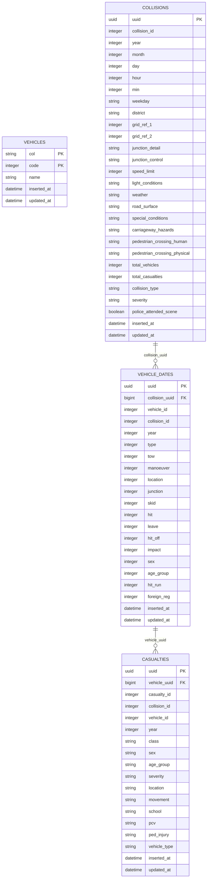

# Owl

## Setup

### Database

To setup database use docker compose, by running

```bash
docker-compose up -d
```

### Elixir, erlang and node versions

Are defined in .tool-versions, you can install them by running

#### Asdf

```bash
asdf install
```

#### Mise

```bash
mise install
```

### Install dependencies

Elixir

```bash
mix deps.get
```

Node

```bash
cd assets
npm i
cd ..
```

### Initialize data

Start with running migrations with

```bash
mix ecto.setup
```

With current data structure the the order of imports is important, for safe initial data setup it's recommended to use

```bash
mix initialize_data
```

### Start application

```bash
iex -S mix phx.server
```

After running this command dashboard should be available under:
`http://localhost:4000/dashboard`

### Run tests

Tests are unfortunately very limited, normally I'd focus way more on them but I had some issues with Ag-Chart and Ag-Grid that consumed big chunk of my time

```bash
mix test
```

### Database setup



### What I'd do differently

- More tests and more accurate
- Consider adding behavior for modules
- Split liveview to components and delegate more logic to other module
- Better control of the data, currently it's really reliable on correctness from csv files
- Think of different way to connect the data, currently it's required to import them in correct order
- Error handling for import and handle import of the same file, eg. `on_conflict: :replace_all`
- Cleanup, it's a lot of features in a short amount of time
- Consider changing data fetching logic, if time range is 2017-1018 it fetches bases on the year, think it might be better to fetch only range 01.01.2017 - 31.12.2017
- Better readme but was running short on time :|
